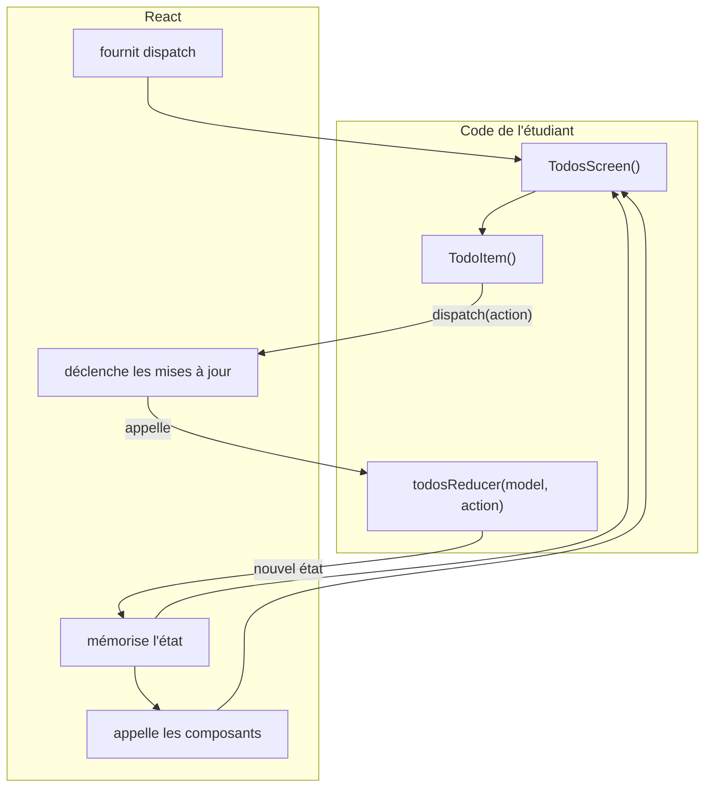
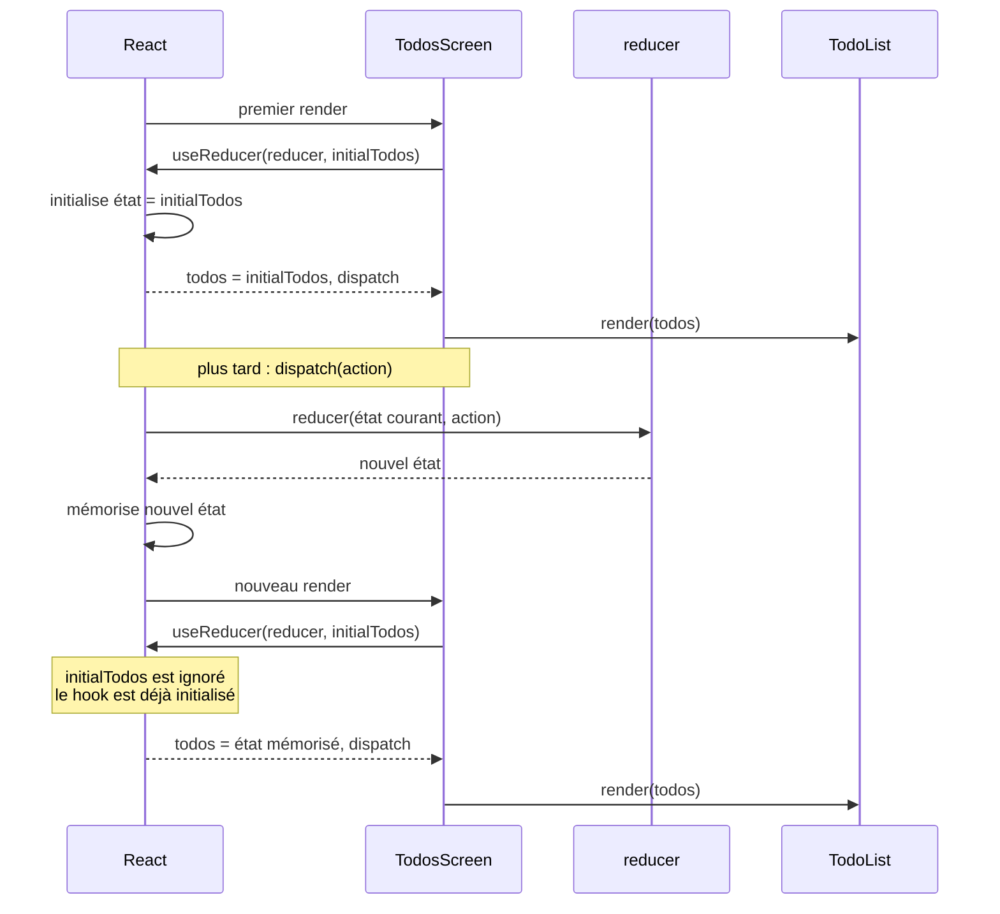
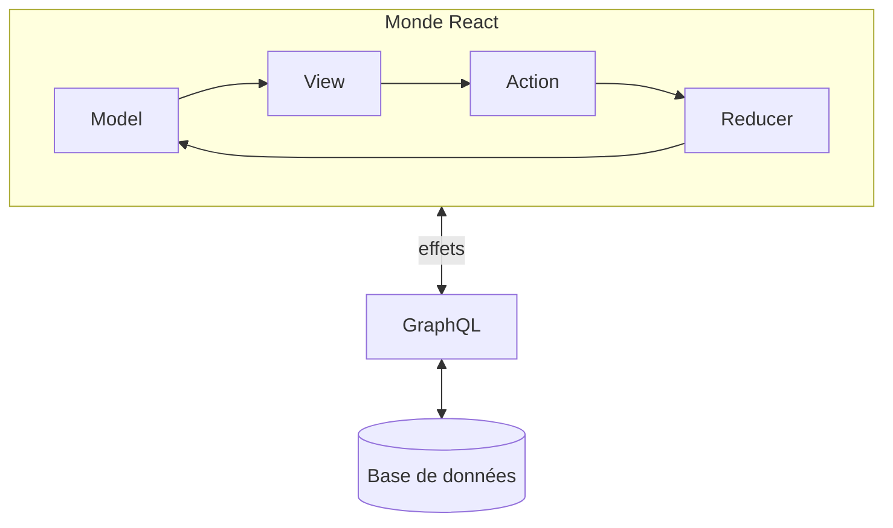

# React Native

React est une bibliothèque JavaScript permettant de construire une interface utilisateur à partir de **composants**.

React Native applique ce modèle à la construction d'applications mobiles. Nous utiliserons **Expo**, qui fournit un environnement permettant de développer et tester une application React Native sans avoir à gérer directement la chaîne de compilation Android ou iOS.

L'objectif de ce cours n'est cependant pas d'étudier l'infrastructure de React Native. Nous nous intéresserons à deux idées :

- construire une application selon un **modèle fonctionnel** ;
- connecter cette application à des données accessibles par **GraphQL**.
- maîtriser l'asynchrone

## Principes

Contrairement à un programme classique, notre code ne contrôle pas la boucle d'exécution : c'est React qui appelle nos composants et nos fonctions lorsque cela est nécessaire. Ce principe est appelé *inversion de contrôle*.

Les composants React sont les fonctions que nous fournissons au framework pour décrire l'interface. À partir des données qu'ils reçoivent (*props*) et de l'état fourni par React, ils retournent une description de la vue en JSX. Lorsque l'état change, React rappelle les composants concernés afin d'obtenir une nouvelle description de l'interface.

1. React met à disposition un service de dispatch pour modifier l'état
1. ce n'est pas le code qui modifie l'état
1. c'est l'utilisation d'un dispatch qui déclenche la modification d'état

## Une interface est une fonction

La vue affichée par l'application est une fonction de son modèle.
Considérons par exemple une donnée :

```js
const todo = {
  id: 1,
  content: "Acheter du pain",
  done: false
};
```

On peut écrire un composant chargé de représenter cette donnée :

```jsx
function TodoItem({ todo }) {
  return (
    <Text>
      {todo.done ? "✓" : "○"} {todo.content}
    </Text>
  );
}
```

## Les composants sont des fonctions

Un composant React est une fonction JavaScript.
Les données transmises au composant sont appelées des **props**.

```jsx
function Welcome({ name }) {
  return <Text>Bonjour {name}</Text>;
}
```

On peut l'utiliser dans une autre vue :

```jsx
function HomeScreen() {
  return (
    <View>
      <Welcome name="Alice" />
      <Welcome name="Bob" />
    </View>
  );
}
```

Les composants peuvent ainsi être composés pour construire progressivement une interface.

Une application React est essentiellement **un arbre de fonctions produisant des vues**.

## JSX

Les fonctions précédentes semblent retournent du JSX :

```jsx
return <Text>Bonjour {name}</Text>;
```

```jsx
<Text>{todo.done ? "fait" : "à faire"}</Text>
```

## Ne pas modifier le modèle

Considérons une tâche :

```js
const todo = {
  id: 1,
  content: "Acheter du pain",
  done: false
};
```

Nous éviterons de modifier directement cette valeur :

```js
todo.done = true;
```

Nous construirons plutôt une **nouvelle valeur** :

```js
const newTodo = {
  ...todo,
  done: true
};
```

L'opérateur `...` recopie ici les propriétés de `todo`.

L'ancien modèle n'est pas modifié.

Cette notion d'**immutabilité** est fondamentale dans notre manière de programmer avec React.


## Transformer le modèle : reducer

Il nous faut maintenant une fonction qui détermine comment une action transforme le modèle.

Cette fonction est appelée un **reducer**.

```js
function todosReducer(todos, action) {
  switch (action.type) {

    case "todoDeleted":
      return todos.filter(
        todo => todo.id !== action.id
      );

    case "todoToggled":
      return todos.map(
        todo =>
          todo.id === action.id
            ? { ...todo, done: !todo.done }
            : todo
      );

    default:
      return todos;
  }
}
```

Le reducer est une **fonction pure** : déterministe et sans effet de bord. Pour un même modèle et une même action, il retourne toujours le même résultat. Il ne modifie pas le modèle reçu.

*Il ne réalise ni accès réseau, ni accès à une base de données, ni affichage.*

Il ne dépend même pas de React.

## Dispatch

Analysons le fonctionnement d'un composant pourvu d'un dispatch, un *service* fourni par React pour appliquer une action. C'est bien un service car React doit être tenu au courant de la modification de l'état, pour rafraîchir les composants qui en dépendent.

On détermine un dispatch avec `useReducer` à partir :

* de l'état initial
* du reducer

On récupère une variable d'état et un dispatch. Le dispatch peut être fourni aux composants enfants par les props.






`useReducer` ne signifie pas « calcule-moi un état à partir de ces arguments ».
`useReducer` signifie : « React, retrouve l'état associé à ce hook ; s'il n'existe pas encore, initialise-le avec initialTodos. »
Le préfixe use est significatif : `useReducer` n'est pas une fonction pure ordinaire ; c'est une porte d'accès à un état que React conserve hors de votre fonction composant.

```js
  const [todos, dispatch] = useReducer(todosReducer, initialTodos);
```

« React, voici la fonction qui décrit l'évolution de mon modèle et voici son état initial. Donne-moi en retour l'état courant et le moyen de lui envoyer des actions. »

## Une application minimale

Dès le début du cours, notre application comportera trois écrans :

```text
Home
Todos
About
```

```text
├── AGENTS.md
├── App.js
├── app.json
├── assets
│   ├── ...
├── components
│   └── TodoItem.js
├── index.js
├── model
│   └── todos.js
├── package.json
├── package-lock.json
└── screens
    ├── AboutScreen.js
    ├── HomeScreen.js
    └── TodosScreen.js
```

Nous placerons :

```text
app/          les écrans et la navigation
components/   les composants graphiques
model/        le modèle et ses transformations
api/          les communications avec le serveur
```

# Syntaxe ES6

`React` (et donc React Native) utilise la version ES6 de Javascript,
avec laquelle il convient de se familiariser, sous peine de ne pas
comprendre le code qu'on lit ou qu'on doit écrire.

## Module Javascript

On peut exporter la définition d'une fonction ou d'une variable de deux façons :

* export nommé :

```js
// définition dans le fichier du module MonModule.js
export maVar = ...
export function maFonction(...){ ...

// utilisation dans un autre module
import { maVar, maFonction } from './MonModule' // chemin relatif
```

* export par défaut :

```js
// définition dans le fichier du module MonModule.js
const maVar = ...
export default maVar; 

// utilisation dans un autre module
import maVar from './MonModule'
```

## Affectation de multiples variables
### à partir d'un objet structuré

```js
const { film, displayDetailForFilm } = this.props
```
équivaut à

```js
const film = this.props.film
const displayDetailForFilm = this.props.displayDetailForFilm
```

### à partir d'un tableau

C'est l'[affectation par décomposition](https://developer.mozilla.org/fr/docs/Web/JavaScript/Reference/Operators/Destructuring_assignment#D%C3%A9composition_d'un_tableau)\ :

```js
const [a, b] = tab
```
équivaut à

```js
const a = tab[0]
const b = tab[1]
```

## Fonction fléchées (Arrow function)

ES6 permet de définir des fonctions avec la syntaxe suivante :

```js
// declaration de fonction
function coucou(aqui) {
  return `coucou, ${aqui}!`;
}

// expression de fonction
const coucou = function(aqui) {
  return `coucou, ${aqui}!`;
}

// arrow function
const coucou = (aqui) => {
  return `coucou, ${aqui}!`;
}
```

La première différence est qu'une fonction fléchée retourne implicitement une valeur si on n'utilise pas les accolades :

```js
const increment = (num) => num + 1;
// équivaut à
const increment = (num) => {return num + 1};
```

La deuxième différence importante que nous utiliserons dans React est
la valeur de `this` considérée par une méthode de classe, selon
qu'elle est définie par une fonction classique ou une fonction
fléchée.

Il faut retenir que :

- dans le cas d'une méthode définie par une fonction classique, `this`
  est déterminé par la fermeture du contexte d'appel (closure) : si
  `this` existe dans le contexte d'appel, c'est ce `this` qui sera
  utilisé à l'intérieur de la méthode. Ce n'est généralement pas ce
  que l'on souhaite lorsqu'on fournit une méthode comme *callback*, on
  souhaite que la *callback* utilise le `this` défini lors de
  l'écriture de la méthode.
  
- si la méthode est définie par une fonction fléchée, la nature de
  `this` est décidée *syntaxiquement*, c'est-à-dire que c'est le
  `this` de la définition de la méthode.

[Plus de détails](https://dmitripavlutin.com/differences-between-arrow-and-regular-functions)

## Modèles de libellés

Ce sont des chaînes de caractères délimités par des *backquote* permettant d'insérer des fragments de code Javascript\ :
```js
var a = 5;
var b = 10;
console.log(`Quinze vaut ${a + b}`);
```

# Initialisation d'une application

## Sur les machines du département et en particulier sur la VDI

Voir [les détails ici](https://ecampus.unicaen.fr/mod/page/view.php?id=994368)

* télécharger l'[archive du projet avec le dossier node_modules dont les liens symboliques sont déférencés](https://ecampus.unicaen.fr/mod/resource/view.php?id=994363)
* la désarchiver dans `~/Documents`
* renommer le dossier selon votre choix

## Sur votre machine personnelle

Voir <https://reactnative.dev/docs/environment-setup>

```
npx create-expo-app AwesomeProject
```

## Démarrage du projet

Une fois installé, il suffit de faire `npm run start` ou `npx expo`. Un serveur `expo` est lancé, vous permettant d'ouvrir l'émulateur web\ :

* appuyer sur `w`
* le projet est alors compilé avec `webpack`
* le navigateur est ouvert pour pointer sur <http://localhost:19006/>
* en cas de modification d'un fichier source, le projet est recompilé

En cas d'erreur de compilation, un message est affiché dans la console du compilateur, c'est-à-dire dans le terminal qui a lancé la compilation.

## Exécution sur tablette/mobile

Votre tablette/mobile doit être sur le même réseau que la machine qui fait tourner le serveur `expo`. Si votre serveur est sur la VDI ou une machine de TP, **ce n'est pas possible** car le wifi `eduroam` est un reseau indépendant de l'infrastructure de l'université.

Vous devez donc faire tourner le serveur sur votre machine personnelle.

Sur votre tablette/mobile, installez l'application `Expo go` et fournissez lui l'adresse du serveur.

Vous pouvez également utiliser les serveurs d'`expo` pour construire un `APK Android`, installable sur votre device.

## Gestion de la console de développement

Les erreurs de compilation/paquetage sont affichées dans le terminal qui a lancé la commande `npx expo` ou `npm run start`.

Si vous utilisez le navigateur pour tester votre projet, la console qui recoît vos affichages `console.log(...)` est celle du navigateur.

Si vous testez sur tablette/mobile, la console d'affichage est le terminal qui a lancé la commande `npx expo` ou `npm run start`.


