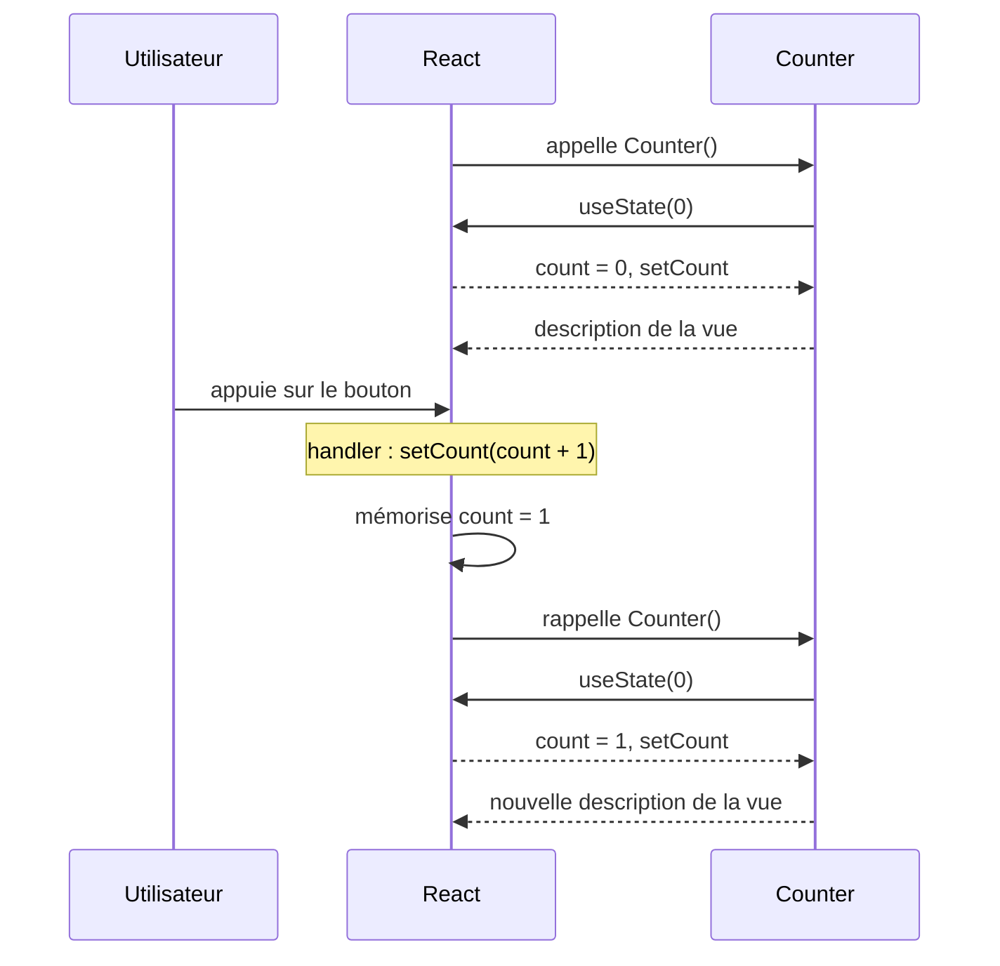

# Initiation à la gestion de l'état (*state*)

L'*état* (*state*) regroupe les données susceptibles d'évoluer au cours de l'utilisation d'un composant et dont l'évolution doit être prise en compte par React pour mettre à jour l'interface.

Ici, nous allons ajouter un texte qui indique combien de fois on a appuyé sur un bouton. Nous souhaitons que cet affichage évolue à chaque appui.

## Le hook `useState`

Une fonction composant ne conserve elle-même aucune variable entre deux rendus : elle est simplement rappelée par React lorsqu'un nouveau rendu est nécessaire.

React peut cependant associer un état persistant à un composant grâce au *hook* (hameçon) `useState`. Les hooks permettent ainsi à une fonction composant d'accéder aux fonctionnalités prises en charge par React.

Au début du composant, nous écrivons :

```js
const [count, setCount] = useState(0);
```

`useState` retourne une paire composée :

- de `count`, la valeur de l'état pour le rendu courant ;
- de `setCount`, une fonction permettant de demander à React une modification de cet état.

La valeur `0` passée à `useState` est la valeur initiale de l'état. Elle est utilisée par React lors de la première création du composant.

Il est important de comprendre que :

```js
setCount(count + 1);
```

ne modifie pas directement la variable `count`. Cette instruction demande à React que la valeur de l'état devienne `count + 1`.

React mémorise cette nouvelle valeur puis déclenche un nouveau rendu du composant. Lors de ce nouveau rendu, la fonction composant est rappelée et `useState` fournit la nouvelle valeur de `count`.

On retrouve ici le principe d'*inversion de contrôle* : notre code décrit le composant et demande des changements d'état, tandis que React conserve l'état et décide quand rappeler le composant pour mettre à jour l'interface.

## Le composant `Counter`

Le composant complet est :

```jsx
import React, { useState } from "react";
import { Button, Text, View } from "react-native";

export default function Counter() {

    const [count, setCount] = useState(0);

    return (
        <View>
            <Text>Le bouton a été pressé {count} fois</Text>
            <Button
                title="Press me"
                onPress={() => setCount(count + 1)}
            />
        </View>
    );
}
```

Le gestionnaire d'événement :

```js
() => setCount(count + 1)
```

est appelé par React lorsque l'utilisateur appuie sur le bouton. Il demande une modification de l'état, qui entraînera ensuite un nouveau rendu du composant.

Le mécanisme peut être résumé ainsi :



## Grouper plusieurs composants

Le composant contient ici deux composants natifs, `Text` et `Button`. Ils sont regroupés dans un composant `View`, qui joue notamment le rôle de conteneur :

```jsx
<View>
    <Text>Le bouton a été pressé {count} fois</Text>
    <Button
        title="Press me"
        onPress={() => setCount(count + 1)}
    />
</View>
```

Lorsque l'on souhaite uniquement grouper plusieurs composants sans ajouter de `View`, on peut utiliser un *fragment* :

```jsx
<React.Fragment>
    <Text>Le bouton a été pressé {count} fois</Text>
    <Button
        title="Press me"
        onPress={() => setCount(count + 1)}
    />
</React.Fragment>
```

ou, avec sa syntaxe concise :

```jsx
<>
    <Text>Le bouton a été pressé {count} fois</Text>
    <Button
        title="Press me"
        onPress={() => setCount(count + 1)}
    />
</>
```

`useState` convient bien à la gestion d'un état simple. Nous verrons ensuite `useReducer`, qui permet de décrire plus explicitement l'évolution d'un état structuré à partir d'*actions*.